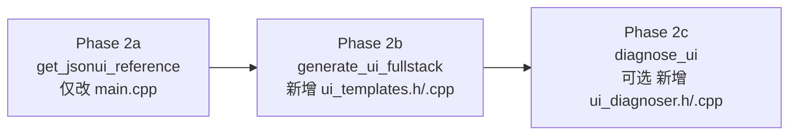

# JSON UI MCP 工具设计方案（全栈前端版）

## 目标

让 AI 达到"MC JSON UI 全栈前端工程师"级别，等价于 H5 开发中对 HTML/CSS/JS 全栈的熟练度：

| H5 前端能力 | MC JSON UI 等价能力 |
|---|---|
| 知道 HTML/CSS 标签和属性 | 知道控件 type、所有属性、布局系统 |
| 组件复用（React/Vue） | `@namespace.control` 继承 + `$` 变量系统 |
| 事件处理（JS addEventListener） | JSON `bindings` + Python `@ViewBinder.binding` |
| 看设计稿生成页面代码 | 看草图生成 JSON UI + Python UI 类 |
| 查 MDN 文档 | 查 common / netease 组件库 |
| 调试/报错定位 | JSON UI 常见错误诊断 |
| 生成完整页面（HTML+JS） | 生成完整 screen JSON + Python UI 类（全栈）|

---

## 知识库现状（已有）

`search_docs` 可检索以下 UI 相关知识：

- `18-界面与交互/30-UI说明文档.md`（2653 行，JSON 语法完整参考）
- `18-界面与交互/70-UI数据绑定.md`（721 行，bindings + ViewBinder）
- `18-界面与交互/40-UIAPI文档.md`（Python UI API）
- `18-界面与交互/50-UI控件对象.md`（控件对象 API）
- `GameAssets/resource_packs/vanilla/ui/` 大量原版 UI JSON 参考
- `GameAssets/resource_packs/vanilla_netease/ui/` 网易扩展 UI JSON

**现有 `search_docs` 的问题**：返回分块片段，AI 需要多次调用才能拼出完整知识，写 UI 时的认知负担高。

---

## 工具设计（完整版）

### Phase 2a：`get_jsonui_reference` — 内置语法速查手册

**模式**：硬编码，无参数，一次调用获取全部核心知识。

**内容（精炼自知识库，约 300-500 行）**：

```
一、控件类型速查
  screen / panel / image / label / button
  stack_panel / grid / scrolling_panel / edit_box / custom / toggle
  每种类型的核心属性清单

二、布局系统
  size: "100%+0px" | "200%y" | "100%cm" | 固定数字
  anchor_from/anchor_to: 九宫格 9 个值
  offset / max_size / min_size / layer / clips_children

三、继承与变量系统
  "name@namespace.parent": {} 继承写法
  "$var": "value" / "$var|default": "fallback"
  controls 数组中的匿名 key 写法
  跨文件引用规则

四、数据绑定（JSON 侧）
  bindings 数组结构
  "#binding_name" vs "$var" 的本质区别
  binding_condition: always / always_when_visible / once / visibility_changed
  collection_details / view_details 绑定类型

五、Python 侧对应关系
  UI 类注册方式（RegisterUI / PushScreen）
  【优先】正向接口主动调用：SetText / SetVisible / SetPosition / SetSprite 等
    → 在事件/回调中直接操作控件，简单直接，推荐首选
  【备选】绑定接口（引擎反向拉取数据）：@ViewBinder.binding(BF_BindString, "#name")
    → 仅在正向接口无法满足需求时使用（如需引擎高频刷新的集合数据）
  GetBaseUIControl() 获取控件对象

六、网易模板库速查（netease_editor_template_namespace）
  按钮三态所需完整 $ 变量列表
  scrolling_panel 所需完整 $ 变量列表
  进度条 / 输入框背景 $ 变量列表

七、原版 common 常用组件
  common.button（$pressed_button_name 等关键变量）
  common.scrolling_panel（$scrolling_content 等关键变量）

八、最小可用完整示例
  screen JSON（含 namespace、main、关闭按钮）
  对应 Python UI 类骨架（含注册、回调、绑定）
```

**改动**：仅 `src/main.cpp`

---

### Phase 2b：`generate_ui_fullstack(template_type, namespace, mod_name)` — 全栈模板生成

**核心升级**：不只生成 JSON，同时生成配套的 Python UI 类骨架。  
这对应 H5 开发中"生成完整页面代码（HTML + JS）"的能力。

**接口**：
```
generate_ui_fullstack(
    template_type: string,  // 见下表
    namespace: string,      // JSON UI 命名空间，如 "MY_MOD_UI"
    mod_name: string        // Python 模块名，如 "mymod"
) -> {
    json_ui: string,        // JSON UI 文件内容
    python_class: string,   // Python UI 类文件内容
    ui_defs_entry: string   // 需要添加到 _ui_defs.json 的条目
}
```

**模板类型**：

| template_type | JSON 侧 | Python 侧 |
|---|---|---|
| `screen_basic` | 基础界面（背景+关闭按钮+标题） | UI 类 + 关闭按钮回调 |
| `screen_list` | 滚动列表界面 | UI 类 + 列表数据绑定 |
| `screen_grid` | 网格界面（背包式） | UI 类 + 集合绑定 |
| `screen_form` | 表单界面（输入框+确认按钮） | UI 类 + 输入事件 + 确认回调 |
| `screen_tabbed` | 标签页界面 | UI 类 + 标签切换逻辑 |
| `hud_overlay` | HUD 覆盖层（不拦截操作） | UI 类 + 数据绑定（血量/计分板等）|
| `widget_button` | 单独按钮控件 | 无 Python（纯 JSON 组件）|
| `widget_progress` | 进度条控件 | 无 Python（纯 JSON 组件）|

**Python UI 类骨架示例（screen_basic）**：
```python
# -*- coding: utf-8 -*-
# 由 mcdk-assistant generate_ui_fullstack 生成
from mod.client.ui.screenNode import ScreenNode
import mod.client.extraClientApi as clientApi

# 注册 UI（在 ModMain 的 ClientInit 中调用）
def RegisterMyUI():
    clientApi.RegisterUI("mymod", "my_screen", "mymod.ui.MyScreenNode.MyScreenNode", "MY_MOD_UI.main")

# 若存在QuModLibs应优先考虑使用QuModLibs的UI以及注册方案（全自动）
class MyScreenNode(ScreenNode):
    def __init__(self, namespace, name, param):
        ScreenNode.__init__(self, namespace, name, param)
        self._title_ctrl = None

    def Create(self):
        """界面创建后调用，在这里缓存控件引用，用于后续正向接口调用"""
        # 【推荐】缓存控件路径，后续通过正向接口主动操作
        self._title_ctrl = self.GetBaseUIControl("/panel/workPanel/topPanel/label")

    def SetTitle(self, text):
        """【正向接口示例】主动设置标题文本"""
        if self._title_ctrl:
            self._title_ctrl.asLabel().SetText(text)

    def OnCloseButton(self, args):
        """关闭按钮回调（通过 $pressed_button_name 绑定到此函数名）"""
        self.SetScreenVisible(False)

    # 【说明】绑定接口（@ViewBinder.binding）性能更高，但较复杂。
    # 优先使用正向接口（SetText/SetVisible/SetSprite 等主动调用），
    # 仅在正向接口无法满足需求时（如需引擎高频刷新集合数据）才使用绑定。
```

---

### Phase 2c：`diagnose_ui(json_content)` — JSON UI 错误诊断（可选）

对应 H5 开发中"浏览器控制台报错定位"的能力。

**输入**：JSON UI 文件内容（字符串）  
**输出**：常见错误列表 + 修复建议

**检查项**：
- namespace 是否定义
- 继承的控件是否存在（引用 common/netease 的组件是否拼写正确）
- `$` 变量是否在继承时传入了必要的参数
- controls 数组中 key 是否唯一
- size/offset 单位格式是否正确（`"100%+0px"` 不是 `"100% + 0px"`）
- `bindings` 中 `binding_name` 是否以 `#` 开头

**实现**：文本正则检查 + 硬编码规则，无需 JSON 解析库

---

## 行号追踪库最终结论

**问题**：JSON UI 文件含 `//` 注释，`nlohmann/json` 支持注释但不追踪行号。

**结论**：**当前不引入新库**，理由：

1. `search_docs` 已提供行号，AI 可精确定位到原版 UI 文件的具体控件
2. Phase 2a 的速查手册覆盖了 AI 需要的核心知识，不需要实时解析文件
3. Phase 2c 的错误诊断用文本正则即可，不需要 DOM 解析

**如果未来需要（Phase 3 的 UI diff/merge 工具）**：  
推荐 **rapidjson**（`kParseCommentsFlag` 支持 `//` 注释，SAX 模式 `stream.Tell()` 精确字节偏移，header-only，与项目 C++20 兼容）。

---

## 实施顺序



## 文件改动预估

| Phase | 新增/修改文件 | 说明 |
|---|---|---|
| 2a | `src/main.cpp` | 注册 get_jsonui_reference 工具 |
| 2b | `src/tools/ui_templates.h` | 模板声明 |
| 2b | `src/tools/ui_templates.cpp` | JSON + Python 模板字符串 |
| 2b | `src/main.cpp` | 注册 generate_ui_fullstack 工具 |
| 2c | `src/tools/ui_diagnoser.h` | 诊断器声明 |
| 2c | `src/tools/ui_diagnoser.cpp` | 正则规则检查 |
| 2c | `src/main.cpp` | 注册 diagnose_ui 工具 |
